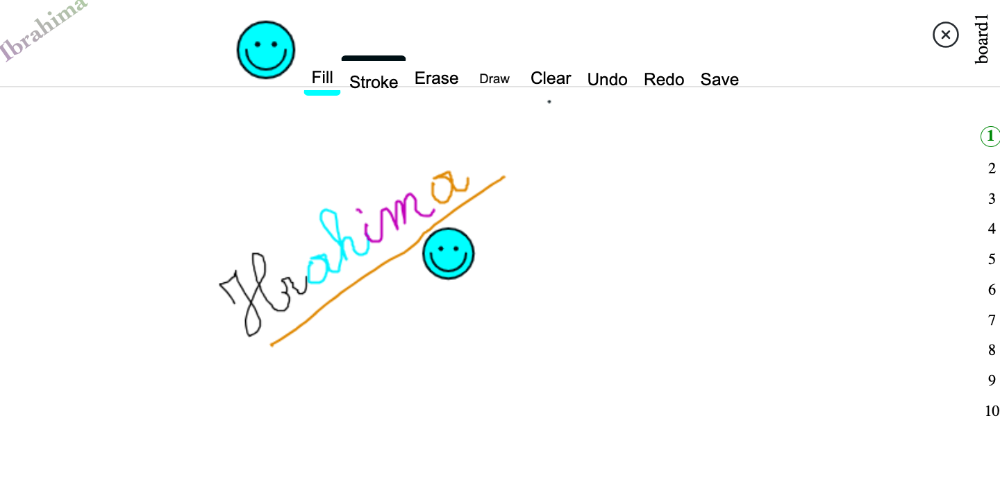

<h1>MULTI-BOARS-SHARING</h1>

<em>Yes i am Python developper, yes I know</em>

<h3>This application is Coded in angular-typescript(client side and contains 10 boards) + nodeJS(server side)</h3>

<h5>I extend the fonctionalities for already an existing package: https://github.com/webfactorymk/ng2-canvas-whiteboard/tree/master</h5>
